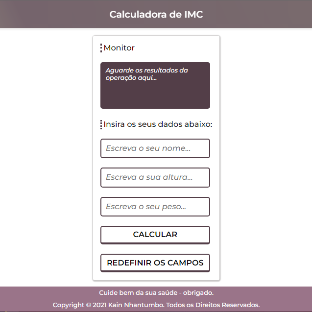

# Aplicativo de Cálculo de IMC
Esta aplicação calcula o *Índice de Massa Corporal* (IMC) com base na leitura de dados introduzidos pelo usuário, como a altura e o peso atual.\
\
**Note: you can find this app deployed version at [https://kainnhantumbo.github.io/03.-App-Calculadora-de-IMC](https://kainnhantumbo.github.io/03.-App-Calculadora-de-IMC 'See deployed version')**\
\

## Cálculo
Para o cálculo, são usadas as seguintes propriedades: a altura e o peso. O nome pedido ao usuário serve apenas para montar a estrutura da mensagem de resposta após o cálculo.

## Como utilizar
Para calcular o IMC, basta inserir o seu nome, a altura (de preferência em metros) e o seu peso (pode ser em quilos) nos respetivos campos e efetuar o cálculo. O resultado será exibido no monitor.

## Persistência de Dados
Este aplicativo não guarda nenhum dados do usuário nem faz backups em nuvem.

***

# BMI Calculation Application
This application calculates the *Body Mass Index* (BMI) based on reading user-entered data such as height and current weight.\
\
**Note: you can find this app deployed version at [https://kainnhantumbo.github.io/03.-App-Calculadora-de-IMC](https://kainnhantumbo.github.io/03.-App-Calculadora-de-IMC 'See deployed version')**\
\

## Calculation
For the calculation, the following properties are used: height and weight. The name requested from the user only serves to assemble the structure of the response message after the calculation.

## How to use
To calculate your BMI, simply enter your name, height (preferably in meters) and your weight (can be in kilograms) in the respective fields and perform the calculation. The result will be displayed on the monitor.

## Data Persistence
This app does not save any user data or cloud backups.

***
## Contact

**E-mail:** [nhantumbok@gmail.com](nhantumbok@gmail.com 'Send an email')\
**Github:** [https://github.com/KainNhantumbo](https://github.com/KainNhantumbo 'See my github profile')  
**Portifolio:** [https://portifolio-dev-kainnhantumbo.vercel.app](https://portifolio-dev-kainnhantumbo.vercel.app 'See my personal portifolio')

### If you like this project, please consider leaving a star on this repository.

### With kindest regards, Kain Nhantumbo from Mozambique.

## License

Licensed under MIT  
**Copyright &copy; 2022 Kain Nhantumbo.**